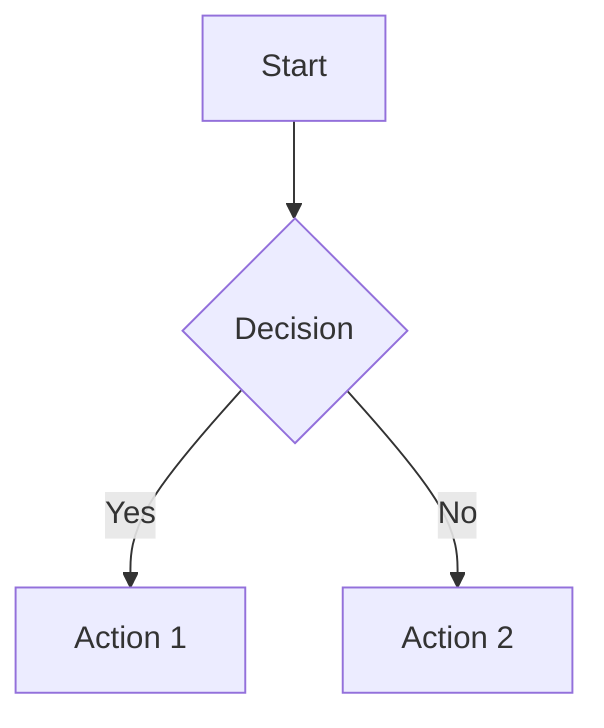
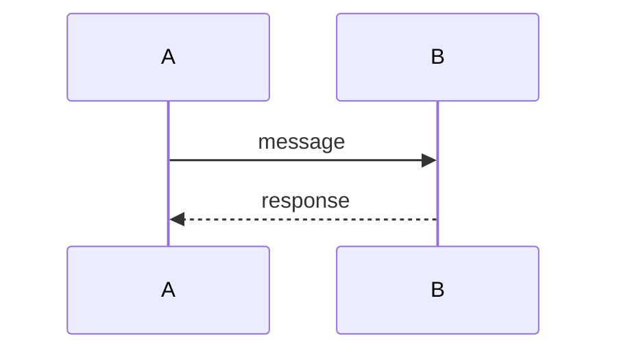

# Ultra Plan With Diagrams

Generate structured implementation plans, brainstorm visualizations, and architecture diagrams.

## When to Use

- User wants a plan, roadmap, or implementation strategy
- User wants to brainstorm ideas visually
- User needs architecture or flow diagrams in markdown
- Multi-step project benefiting from visual structure

## When NOT to Use

- Single-line fixes (skip plan-gate: "trivial, skipping")
- Pure questions with no implementation
- Tasks where user says "just do it, no plan"
- Review-only tasks → `adversarial-verify`

## Output Formats

| Format | When | Portable |
|--------|------|----------|
| **ASCII Box** | Primary — hierarchies, flows | Any markdown renderer |
| **Mermaid** | Fallback — ASCII cutoff triggered | GitHub, GitLab, Notion, Obsidian |
| **Structured Plan** | Task decomposition | Any markdown renderer |

Default: **ASCII + Structured Plan**. Mermaid only when ASCII insufficient.

## Plan Gate (mandatory)

```
GOAL: <one sentence: what is true when done>
UNKNOWNS: <what not verified yet - with verification method>
SUCCESS CRITERIA: <executable proof>
STEPS: <numbered, smallest granularity>
OUT OF SCOPE: <adjacent things NOT to touch>
```

**Rules:**
- Plan comes from evidence, not memory (read files first)
- Every unknown gets verification step
- Success criteria: "npm test passes" not "code works"
- >7 steps = decompose into subtasks

## Plan Structure

```markdown
# [Project] Plan

## Overview
[1-2 sentences]

## Architecture
[ASCII diagram]

## Global Constraints
- [Tech stack, versions, conventions]

---

### Task N: [Component]

**Files:**
- Create: `path/file`
- Modify: `existing.py:123-145`
- Test: `tests/path/test.py`

**Interfaces:**
- Consumes: [from earlier]
- Produces: [for later]

- [ ] **Step 1: Description**
  ```
  code or command
  ```
- [ ] **Step 2: Verify**
  Run: `cmd` Expected: `output`
- [ ] **Step 3: Commit**
  ```bash
  git commit -m "feat: desc"
  ```
```

## ASCII Box Rules

**Construction:**
- Fixed width per row (all boxes identical)
- Top border: `┌` + N×`─` + `┐`
- Bottom: `└` + N×`─` + `┘`
- Text centered with space padding

**Connectors:**
- Arrows `───▶` on same line between boxes
- Vertical lines `│` align with arrow `▼`
- Horizontal: `├───────┤` or `└───────┘`
- Exactly 1 blank line between rows

### Templates

**Linear Flow:**
```
┌──────────┐   ┌──────────┐   ┌──────────┐
│  Step 1  │─▶ │  Step 2  │─▶│  Step 3  │
└──────────┘   └──────────┘   └──────────┘
```

**Tree:**
```
      ┌──────────┐
      │   Root   │
      └───┬──────┘
    ┌─────┴─────┐
    │           │
┌───▼───┐   ┌───▼───┐
│Child A │   │Child B │
└───────┘   └───────┘
```

## ASCII Cutoff → Mermaid

Switch to Mermaid if:
- >6 boxes in single row
- >3 hierarchy levels
- Cross-connections or bidirectional
- Text >24 characters in boxes
- >4 parallel branches

## Mermaid Patterns

**Flowchart:**


**Sequence:**


## Brainstorm Structure

```markdown
# Brainstorm: [Topic]

## Context
[What/why]

## Visual Map
[ASCII mindmap]

## Options

### Option 1
- **What:** [desc]
- **Pros:** [list]
- **Cons:** [list]
- **Effort:** [S/M/L]
- **Risk:** [low/med/high]

## Recommendation
[Which option + 2-3 sentences]

## Next Steps
- [ ] Action 1
```

## Architecture Structure

```markdown
# Architecture: [System]

## Overview
[1 paragraph]

## High-Level
[ASCII component diagram]

## Components

### [Name]
- **Responsibility:** [sentence]
- **Interfaces:** [I/O]
- **Dependencies:** [list]

## Data Flow
[ASCII sequence]

## Decisions
| Q | A | Why |
|---|---|---|
```

## Constraints

- Never use "TBD", "TODO", "fill in later"
- Always include at least one diagram
- Always include verification steps
- Always use exact file paths
- Prefer ASCII over Mermaid
- Keep diagrams to 5-9 nodes
- Label nodes: 2-4 words max

## License

Apache-2.0.