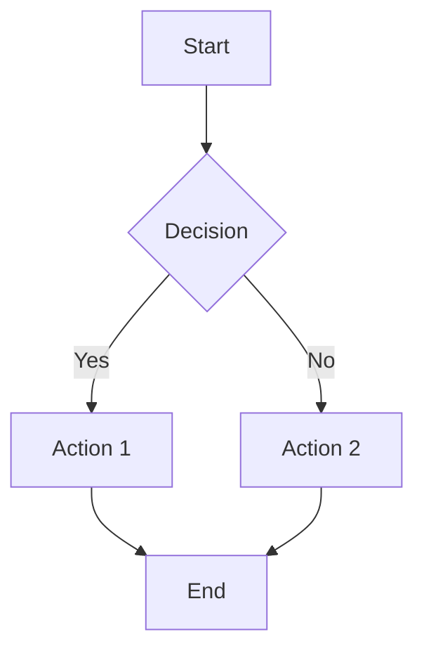
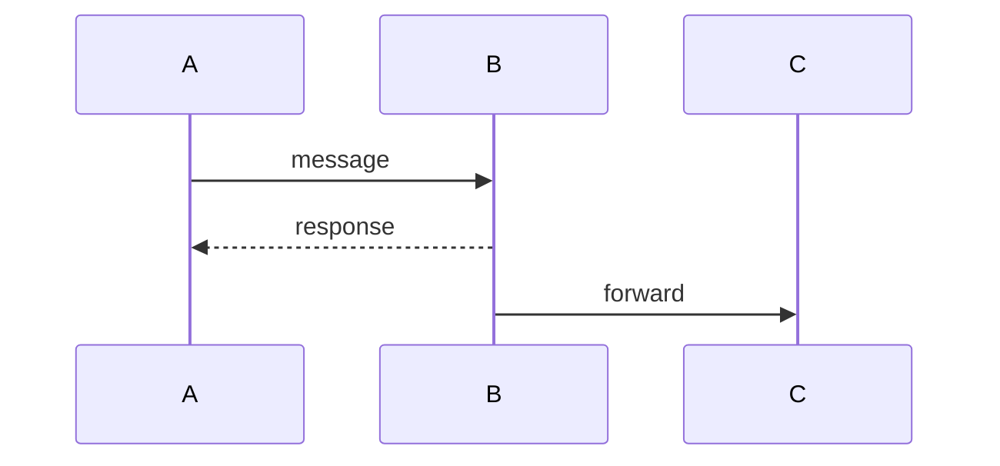
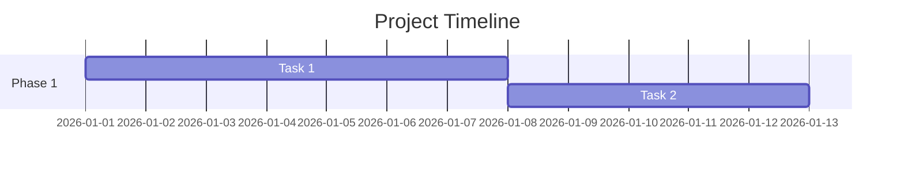
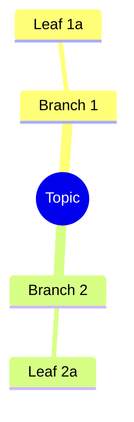

# ultra-plan-with-diagrams

> Generate structured plans, brainstorm visualizations, and architecture diagrams — all in one skill.

## When to Use

- User wants a plan, roadmap, or implementation strategy
- User wants to brainstorm ideas visually
- User needs architecture or flow diagrams in markdown
- Any multi-step project that benefits from visual structure

## Output Formats

| Format              | When                                             | Portable                         |
|---------------------|--------------------------------------------------|----------------------------------|
| **ASCII Box**       | Primary — hierarchies, flows, tables, trees      | Any markdown renderer            |
| **Mermaid**         | Fallback — only when ASCII cutoff triggered      | GitHub, GitLab, Notion, Obsidian |
| **Structured Plan** | Task decomposition, implementation steps         | Any markdown renderer            |

Default: **ASCII + Structured Plan**. Mermaid only when ASCII is insufficient.

## ASCII is Primary

ASCII art renders everywhere — Telegram, Discord, terminals, any markdown viewer.
Mermaid requires renderer support. Always prefer ASCII unless the diagram triggers a cutoff.

## Skill Modes

### 1. Plan Mode (default)

When user provides: objective, requirements, or spec.

**Output structure:**

```markdown
# [Project Name] Plan

## Overview
[1-2 sentences: what this builds and why]

## Architecture
[ASCII diagram showing system/components/flow]

## Global Constraints
- [Tech stack, version requirements, naming conventions]

---

### Task N: [Component Name]

**Files:**
- Create: `path/to/file`
- Modify: `path/to/existing.py:123-145`
- Test: `tests/path/to/test.py`

**Interfaces:**
- Consumes: [what this uses from earlier tasks]
- Produces: [what later tasks depend on]

- [ ] **Step 1: Description**
  ```
  code or command here
  ```
- [ ] **Step 2: Verify**
  Run: `command`
  Expected: `output`
- [ ] **Step 3: Commit**
  ```bash
  git commit -m "feat: description"
  ```

---

### Task N+1: [Next Component]
...
```

**Rules:**
- Every plan starts with an Architecture diagram (ASCII or Mermaid)
- Each task has exact file paths, code blocks, and verification commands
- No placeholders: "TBD", "TODO", "implement later" are forbidden
- Tasks are independently testable and committable
- TDD when applicable: failing test → implement → verify → commit
- Tasks ordered by dependency (Task N+1 can reference Task N's outputs)

### 2. Brainstorm Mode

When user says: "brainstorm", "ideias", "explore options", "think through".

**Output structure:**

```markdown
# Brainstorm: [Topic]

## Context
[What we're exploring and why]

## Visual Map
[ASCII mindmap or decision tree]

## Options Analysis

### Option 1: [Name]
- **What:** [description]
- **Pros:** [list]
- **Cons:** [list]
- **Effort:** [S/M/L]
- **Risk:** [low/medium/high]

### Option 2: [Name]
...

## Recommendation
[Which option and why — 2-3 sentences]

## Next Steps
- [ ] [Actionable item 1]
- [ ] [Actionable item 2]
```

### 3. Architecture Mode

When user says: "architecture", "design", "how should X connect", "system design".

**Output structure:**

```markdown
# Architecture: [System Name]

## Overview
[1 paragraph: what this system does]

## High-Level
[ASCII component diagram]

## Component Details

### [Component Name]
- **Responsibility:** [single sentence]
- **Interfaces:** [inputs/outputs]
- **Dependencies:** [what it needs]

## Data Flow
[ASCII sequence diagram]

## Decisions
| Decision | Choice | Rationale |
|----------|--------|-----------|
| [Q]      | [A]    | [why]     |
```

## ASCII Box Diagram Rules

### Box Construction

Every box uses this template (width = content length + 4 padding):

```
┌──────────────────────┐
│    Box Content Here  │
└──────────────────────┘
```

**Rules:**
1. **Fixed width per row.** All boxes in the same row MUST have identical width.
2. **Count characters precisely.** Top border `┌` + N×`─` + `┐`. Bottom: `└` + N×`─` + `┘`.
3. **Side borders align.** Left `│` at column 0, right `│` at column N+1.
4. **Text centering.** Pad text with spaces: `│  Content  │`. Uneven splits go left (more space left).
5. **No trailing spaces inside boxes.** They break alignment in some renderers.
6. **All boxes in code block** (``` fenced). Monospace rendering is mandatory.

### Connecting Lines

**Rules:**
1. **Arrows point DOWN from center of box above.** Center = (width / 2) from left border.
2. **Vertical lines `│` align with arrow `▼` directly below.**
3. **Horizontal connectors use `├───────┤` or `└───────┘`** at the same column positions as the boxes they connect.
4. **Spacing between rows:** exactly 1 blank line between bottom border and arrow/connector.

### Layout Templates

#### Linear Flow (horizontal)

```
┌──────────┐       ┌──────────┐     ┌──────────┐
│  Step 1  │ ───▶ │  Step 2   │───▶│  Step 3  │
└──────────┘       └──────────┘     └──────────┘
```

Rules:
- Arrow `───▶` on SAME line as box content, between boxes.
- Arrow length = gap between right border of box N and left border of box N+1.
- All boxes in row have IDENTICAL height (same number of lines).

#### 2-Box Horizontal

```
┌──────────────┐          ┌──────────────┐
│   Box A      │          │   Box B      │
└──────┬───────┘          └──────┬───────┘
       │                         │
       └────────────┬────────────┘
                    │
              ┌─────▼─────┐
              │  Box C    │
              └───────────┘
```

#### 3-Box Horizontal

```
┌──────────────┐   ┌──────────────┐   ┌──────────────┐
│   Box A      │   │   Box B      │   │   Box C      │
└──────┬───────┘   └──────┬───────┘   └──────┬───────┘
       │                  │                  │
       └──────────────────┼──────────────────┘
                          │
                    ┌─────▼─────┐
                    │  Box D    │
                    └───────────┘
```

#### Tree (top-down)

```
         ┌──────────────┐
         │    Root      │
         └──────┬───────┘
        ┌───────┴────────┐
        │                │
  ┌─────▼─────┐    ┌─────▼─────┐
  │  Child A  │    │  Child B  │
  └───────────┘    └───────────┘
```

Rules:
- Parent connects to children via `├───────┤` horizontal bar.
- Horizontal bar width = distance from leftmost child center to rightmost child center.
- Each child drops `│` from the horizontal bar at its center position.
- All children in same row have IDENTICAL box width.

### Alignment Checklist (run before every ASCII output)

- [ ] All boxes in same row have equal width (count characters!)
- [ ] All text centered within boxes (±1 char OK)
- [ ] Vertical lines `│` align between parent and child
- [ ] Arrows `▼` or `▶` connect to correct positions
- [ ] No trailing spaces anywhere
- [ ] All diagrams wrapped in ``` code block (monospace)

### ASCII Cutoff → Switch to Mermaid

If the diagram has ANY of these:
- More than 6 boxes in a single row
- Nested hierarchies deeper than 3 levels
- Cross-connections or bidirectional arrows
- Text longer than 24 characters in any box
- More than 4 parallel branches

→ Switch to Mermaid for that diagram. Keep ASCII for simpler diagrams in the same document.

## Mermaid Patterns Reference (fallback only)

### Flowchart


### Sequence


### Gantt


### Mindmap


## Constraints

- **Never** use placeholder text ("TBD", "TODO", "fill in later")
- **Always** include at least one diagram per plan
- **Always** include verification steps (commands, expected output)
- **Always** use exact file paths when referencing code
- **Prefer** ASCII over Mermaid (portable everywhere)
- **Keep** diagrams to 5-9 nodes (readable, not dense)
- **Label** diagram nodes with short text (2-4 words max)
- **Count characters** before writing ASCII boxes

## Integration Notes

- ASCII renders on every platform — no renderer dependency
- For HTML output, use the diagram-maker skill instead
- For Excalidraw (editable), use the diagram-maker skill
- This skill targets **markdown-native** output only
